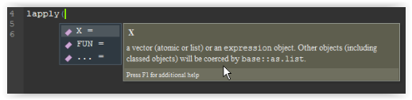
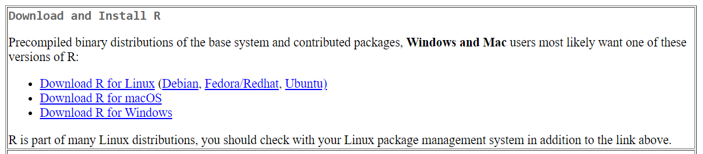
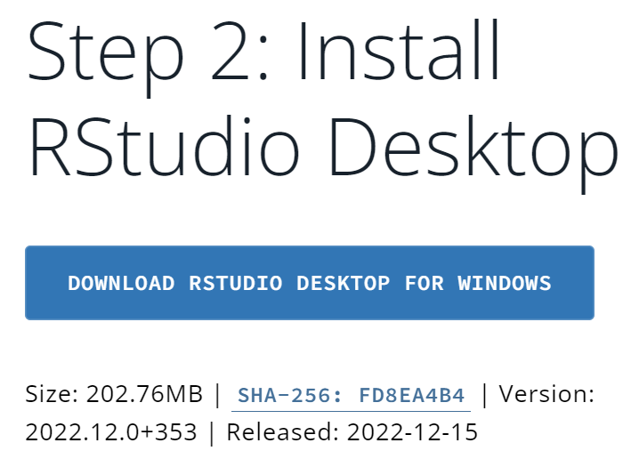
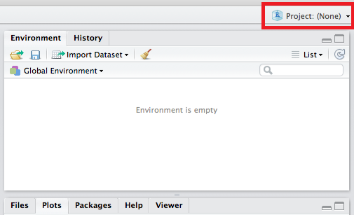
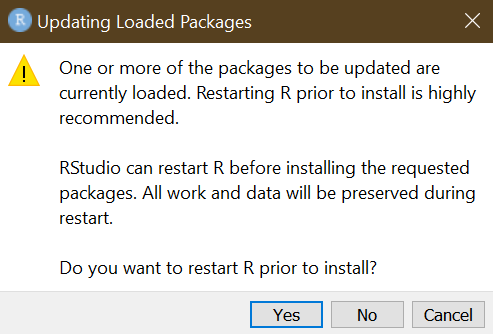
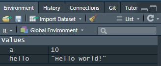
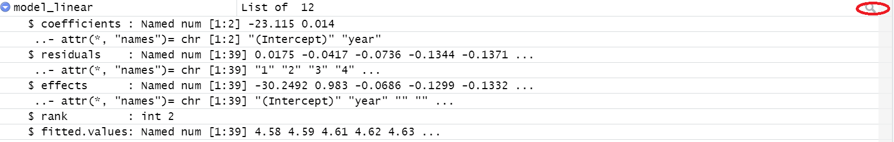
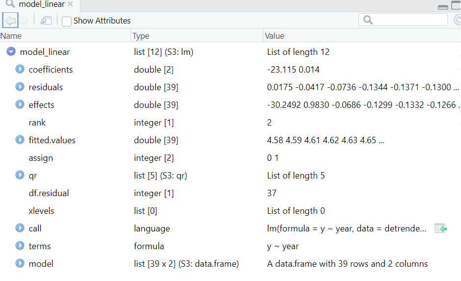

```{r setup, include=FALSE}
gc()
rm(list = ls())
knitr::opts_chunk$set(
echo = TRUE,
cache = FALSE,
dpi = 300,
message = FALSE,
warning = FALSE,
fig.height = 3.5
)
source("../scripts/packages.R")

options(huxtable.bookdown = TRUE)
options("huxtable.knitr_output_format" = "html")
```

```{r xaringanExtra-clipboard, echo=FALSE}
xaringanExtra::use_clipboard()
# this to enable clipboard for code chunks
```

## Why R?

1.  R is **open-source**.

-   Free updates and dissemination.

-   Widespread availability of helpful resources like [stackoverflow](https://stackoverflow.com/questions/tagged/r).

2.  R uses **packages**.

-   R consists of Base-R coupled with third-party libraries of pre-written code, or packages. You not need to reinvent the wheel.

3.  R uses **predictive coding** (`Ctrl/Cmd + Space` is very useful).

<center>{width="75%"}</center>

4.  R is compatible with **Markdown**.

-   Author, connect to data, and run code in **R Markdown**, RStudio's native authoring framework for data science.

    -   See this [1-minute video summary](https://rmarkdown.rstudio.com/lesson-1.html) of what R Markdown entails.

## Setup

Before you start, please proceed with the following steps, and download and install the necessary software on your machine:

1.  [R](https://cran.r-project.org/) (The programming language you will be using)

> "R is a freely available language and environment for statistical computing and graphics which provides a wide variety of statistical and graphical techniques: linear and nonlinear modelling, statistical tests, time series analysis, classification, clustering, etc."

Select the appropriate link corresponding to your machine's operating system and follow the subsequent instructions:

<center>{width="100%"}</center>

Execute the newly downloaded `R-4.4.2-win.exe` file and follow the instructions. If you encounter any difficulties, please ask for help!

2.  [RStudio Desktop](https://posit.co/download/rstudio-desktop/) (The program you will be using to interface with the `R` code)

> "RStudio is an integrated development environment (IDE) for R. It includes a console, syntax-highlighting editor that supports direct code execution, as well as tools for plotting, history, debugging and workspace management."

<center>{width="40%"}</center>

Once you have completed downloading and installing `R`, do the same for RStudio. Execute the newly downloaded `RStudio-2024.12.0-467.exe` file and follow the instructions that follow.

3.  After completing Steps 1 and 2, open up RStudio. It should look something like this:

<center>

{width="100%"}

</center>

4.  `File` \> `New Project` \> `New directory` \> `New project` \> `Choose directory location and name`[^1]

[^1]: If you are planning on applying version control to your new project, it is useful to check `Create git repository`.

It is advisable to work from a `R` project, as this keeps track of your most current workspace and variable environment. Its location will serve as your "root folder" or main directory for subsequent operations in the project.

To work from a particular project, open a new project with `File` \> `Open Project` or starting your session in R Studio by clicking the relevant `.Rproj` file.

**For this tutorial: please create a folder, name it what you want to, in that folder create a subfolder called tutorial and save your r-script there. We will list files in directories later.**

<center>

{width="75%"}

</center>

Once operating from a new project, you should be faced with the default workspace, as illustrated in Step 3 above. The pane on the left is called the **Console**. As in `Stata`, code can be typed and executed directly in your console (or "Command" in `Stata`.)

> **Try:** Enter the code `getwd()` in your console to observe the location of your *working directory*, the location of your project.

Alternatively, this code can be stored in- and executed from a script or `.R` file, much like do-files in `Stata`.

5.  Open a new script in the taskbar with `File` \> `New File` \> `R Script` or with `Ctrl/Cmd + Shift + N`. Save the `.R` file in your working directory with `File` \> `Save` or `Ctrl/Cmd + S`.

After creating and saving a new script, you should observe a workspace layout like the one summarised in Table \@ref(tab:workspace).

```{r workspace, echo=FALSE}
read.csv("../images/workspace.csv", header = TRUE) %>%
  knitr::kable(caption = "Workspace Layout")
```

## Basics

With the software installed and operating, and your new project and script created, you are ready to get started with `R` and R Studio. Proceed by copying the code from this post, or by working from the tutorial's corresponding master script available [here](Handout//Intro%20to%20R%20Tutorial%20Script%20(2024).R).

> **NB:** Highlighted code in the console or script can be executed using `Ctrl/Cmd + Enter`. When working from a script, output will typically appear in the console.

### Packages

We rely on **packages** to access pre-written functions performing specific tasks.[^2] Packages can be downloaded and installed from **CRAN**, the official repository of packages, or [**GitHub**](https://github.com/), which often acts as an repository for third-party libraries or beta-versions.

[^2]: Packages are extensions to the `R` language. They contain code, data, and documentation in a standardised collection format that can be installed by users, typically via a centralised software repository such as CRAN (The Comprehensive R Archive Network). CRAN is a network of ftp (file transfer protocol) and web servers around the world that store identical, up-to-date, versions of code and documentation for R.

Installing, loading and maintaining packages can be tedious. Packages need only be installed with `install.packages("x")` once, after which only `load(x)` is necessary.

```{r pac, eval = FALSE}
# First install the package from CRAN
install.packages("pacman")

# Load the installed package into your workspace
library(pacman)
```

If a package `x` has been installed already, `install.packages("x")` will produce the following error:

<center>{width="50%"}</center>

It can be difficult to keep track of all the packages on your machine. The `pacman` package allows us to easily install and load packages from CRAN with `p_load()`, and from GitHub with `p_load_gh()`. This will install and load a new package, or merely load previously installed ones. Let's install the packages we will be using in this tutorial.

```{r packages_setup, eval= FALSE}
# From CRAN
        p_load(fixest, tidyverse, huxtable, modelsummary, glue, skimr, labelled, devtools, MetBrewer) # or
pacman::p_load(fixest, tidyverse, huxtable, modelsummary, glue, skimr, labelled, devtools, MetBrewer)

```

> **NB:** Functions are called using the function's name, e.g., `p_load()`, or its full name, e.g., `pacman::p_load()`. The latter is useful when functions from different packages share the same name.

Directories can be viewed to the bottom-right pane, in addition to plot outputs, currently loaded packages, and help files. Should you ever require help or additional information regarding a specific command, add a `?` before that command and run the code, for example:

```{r glue_help, eval = FALSE}
?pacman::p_load()
```

### Environment

`R` is an object-orientated language. Objects of various classes (scalars, matrices, data frames, vectors, etc.) can be stored in memory for later use. Once named and saved, these objects will appear in your global environment.

We use the assignment operators `<-` or `=` to name and save objects.

> **Shortcut:** `Alt/Option + Minus` to get `<-`

```{r object_example, eval = TRUE}
# object name <- (or =) value(s)
a <- 10
hello <- "Hello world!"
test <- TRUE

# Determine the class of an object
class(a)
class(hello)
class(test)
```

By executing the relevant code, objects should appear in your global environment like this:

  <center>{width="50%"}</center>

  Report these variables in your output by running the following:

```{r object_result, eval = TRUE}
a
# or
print(hello)
# or by using the glue package for something more fancy
glue::glue("It's {test}. I saved a variable which contains {hello} and I stored the number {a}.")
```

### Arrays

An array object is equivalent to a vector of values from the same class. Arrays can be created by concatenating values using the function `c()`.

```{r arrays, eval = TRUE}
x <- c(1, 2, 3, 4)
y <- c(4, 5, 6, 7)
z <- c(7, 8, 9, 10)

# Useful functions to perform on arrays/vectors
sum(x)
min(x)
median(x)

# summary() provides a summary of the functions above
summary(x)

# Missing values denoted by NA
x_with_missing <- c(1, 2, 3, NA)

# Take care to properly treat missing values:
sum(x_with_missing)
sum(x_with_missing, na.rm = TRUE)
```

### Data frames

Data frames, consisting of rows and columns, are the workhorse of statistical analysis in `R`. They can be created in various ways. Rows and columns can also be named. As always: try to keep your names meaningful and functional - here the data frame's name comes from the fact that it is the first data frame. 

```{r dataframes1, eval = TRUE}
# data.frame() can create columns from arrays and assign column names
  df_1 <- data.frame(A = x, B = y, C = z)

# Some useful operations
  # as expected, the below provides the column names
  colnames(df_1)
  
  # if you want to create a dataset that looks the same 
  # as the previous one but with a new name (and therefore more memory):
  df_1_copy <- df_1
  
  # If you want to change the names of your variables
  colnames(df_1_copy) <- c("col1", "col2", "col3")
  colnames(df_1_copy)
  
  # To count the number of rows and columns
    #(sometimes you'll need this if you do  manual transformation)
  nrow(df_1)
  ncol(df_1)
```

Specific rows, columns, and cells can be referenced as follows:

```{r dataframes2, eval = TRUE}
# Return column "A" as a vector
df_1$A

# df_1[row no., column no.] - empty implies all
df_1[, 1]

# Using tidyverse's pipe operator %>%
  # the below pulls all value from the column A
  # it does not replace the values of df_1 with column A
df_1 %>% pull(A)
  # If we wanted to create an array to do that we can write:
col_A <- df_1 %>% pull(A)
```

> **Shortcut:** `Ctrl/Cmd + Shift + M` to get %\>%

  There are numerous ways to subset a data frame.

```{r dataframes3, eval = FALSE}
# Similarly with rows
# Return row 2 as a single row data frame
df_1[2, ]

# Return row 2-3 as a two row data frame
df_1[2:3, ]

# Return cell in row 2 column 1
df_1[2, 1]
```

Let's create a new column named "D":

```{r dataframes32, eval = TRUE}
# Create a new column "D" that is the sum of A and B
df_1$D <- df_1$A + df_1$B

# is the same as
df_1 <- df_1 %>% mutate(D = A + B)
```

We can also create a subset of the data based on a condition. 

```{r dataframes33, eval = TRUE}
  # you can permanently remove missing data from a 
  # data frame using the na.omit code below 
  df_missing <- data.frame(A = x_with_missing, B = y, C = z) 
  
  df_missing_clean <- na.omit(df_missing)
  # count the rows and columns, you will see there is one less row now
  nrow(df_missing_clean)  
  ncol(df_missing_clean)  
  
  # You can also remove rows or columns with specific conditions
  # if we want to drop all rows if the the column value in C is above 9:
  df_missing_9 <- df_missing[df_missing$C < 9, ]

  # count the rows and columns, you will see there is one less row now
  nrow(df_missing_9)  
  ncol(df_missing_9)  
```

### Managing Data Files: Directories and Importing

Data is often imported from external files, such as `.csv` files. Let's consider an example. If you haven't done so already, download the files attached in the email I sent. Alternatively, you can using [this link](https://www.dropbox.com/scl/fi/54uym125ms5kr28muuyf3/r_introduction.zip?rlkey=8jf8rpxelt1m1q3w1xgimlzkl&e=1&st=b0z7yk8m&dl=0). Extract the files in the `.zip` folder and copy the `data` folder into your working directory.
We will generally import data from either the internet or a local drive. Generally, try not to always call data from the  internet. 

#### Directories 
**Only run this code if you are sure about your folder structure. If you struggle with this code, I'll help you at the end.**

To make sure your data loads, you need to confirm that the files exist and are called from the correct location. In the code below, we look for a folder called `data` in our directory. 

Note the location prefix in the code below:
-   The '..' prefix means that the code will go to the parent directory of the current working directory, and then find the file specified 
-   The '.' prefix means that the data is in the subfolder of the current working directory


```{r dir1, eval=TRUE,echo=TRUE}
# DIRECTORIES 
  # It is often useful to confirm your working directory first
  getwd()
  # But often, it helps to confirm all folders in the directory 
    # the recursive stops further subfolders from being searched
    # full.names makes sure we only get the folder name and not the full path)
  folders <- list.dirs(path = ".", full.names = FALSE, recursive = FALSE)
  print(folders)
  # If we do not have the folder in the current working directory, 
  # check the parent directory 
  parent_folders <- list.dirs(path = "..", full.names = FALSE, recursive = FALSE)
  print(parent_folders)
```


We can also use the structure above to create a list with all files in a specific directory - this is often useful for messily-scraped data. Make sure you confirm that the directory references match your folder structure. 
  

```{r dir2, eval=TRUE,echo=TRUE}
# You can list the files in a specific directory as below
  # Here I use the full names as we might want to use the names in the list later
  list_files <- list.files(path = "../data/", recursive = FALSE, full.names = TRUE)
print(list_files)
# You can also  specify that you only want a specific type of file, example CSVs
  list_files_csv <- list.files(path = "../data/", pattern = "\\.csv$", recursive = FALSE, full.names = TRUE)

  print(list_files_csv)
# You can also  specify that you only want files with specific text in them 
  # in this example, we only look for "ireland"
  list_files_irel <- list.files(path = "../data/", pattern = "ireland", recursive = FALSE, full.names = TRUE)
  print(list_files_irel)
  # It returns nothing! This is because we are only looking for files with no capitals
  # we need to ignore the case of the files
  list_files_ire <- list.files(path = "../data/", pattern = "ireland", recursive = FALSE, full.names = TRUE, ignore.case =TRUE)
  print(list_files_ire)
```

Sometimes we also want to create directories to store output in:

```{r directory3, eval=TRUE,echo=TRUE}
# Specify the name of the directory
  dir_name <- "./figures"

# Create the directory
  # Confirm that directory exists, else create it

  if (!dir.exists(dir_name)) {        # this is an if statement; it says if the condition in parentheses is false 
                                      # then create the directory called [dir_name] as defined above
    dir.create(dir_name)
    cat("Directory created:", dir_name, "\n")
  } else {
    cat("Directory already exists:", dir_name, "\n")
  }
```

Alternatively, we know we will always create output in a certain format - and we want to keep it in certain folders: 

```{r directory4, eval=TRUE, echo=TRUE}
# List of folder names 
  # - this helps if you know you'll always have the same structures
  folders <- c("figures", "tables")

# Loop over the list of folder names 
  for (folder in folders) {           # this is a standard for loop, it says to repeat the command for every entry in folders 
                                      # we will call every entry in folders folder; 
                                      # in the first iteration of the loop [folder] will take the value [figures]
                                      # in the second iteration [folder] will take the value [tables] 
                                      # there is no third iterate as folders<-c("figures", "tables") is only two entries long
    # Construct the directory path
    dir_name <- paste0("./", folder)
    
    # Check if the directory exists
    if (!dir.exists(dir_name)) {     
      # If it doesn't, create the directory
      dir.create(dir_name)
      cat("Directory created:", dir_name, "\n")   # this prints that the directory is created, the cat command is to concatenate the text.
    } else {
      cat("Directory already exists:", dir_name, "\n")  #
    }
  }
```

#### Reading data to Data Frames

Now, read the data from the `Ireland_energy.csv` file in the `data` folder using `read.csv()`, and create a data frame called `ire_energy` with an assignment operator. The data represents Ireland's energy consumption data for 1980-2018.


```{r reading1, eval = TRUE, echo=TRUE}

ire_energy <- read.csv(file = "../data/Ireland_energy.csv", 
                       header = TRUE)
# The "file" argument refers to the relative file path from your root directory
# The "header" argument is set to true because the .csv file contains column headings
```

Do the same for a corresponding file containing data on Ireland's population from `Ireland_population.csv`, and create a data frame called `ire_pop`.

```{r reading2, eval = TRUE, echo=TRUE}
ire_pop <- read.csv("../data/Ireland_population.csv")
# Sometimes it's unnecessary to spell out the arguments
  # here, we don't specify that headers are true 
```


<center>

  {width="75%"}
</center>

We now have two data frames. Take a peak at the first 5 observations in `ire_energy` and the last 5 observations in `ire_pop` with the following commands:

```{r displaydf, eval=FALSE}
head(ire_energy, 5) # same as ire_energy[1:5, ]
tail(ire_pop, 5) # same as ire_pop[(nrow(ire_pop) - 4): nrow(ire_pop), ]

# skim() can provide useful overviews of data frames
skimr::skim(ire_pop)
```

### Manipulating Data {#manipulating}

#### Merging Data 

We can merge the two data frames on the basis of some common value, e.g. `Year`, to create a single one called `ireland_df`.

```{r merge1, eval=TRUE}
# We use the merge command as below where x and y 
# are the names of our imported dataframes
ireland_df <- merge(x = ire_energy, y = ire_pop, by.x = "Year", by.y = "Year")
# merge() merges data frames x and y on the basis of some column
# by.x for x's column and by.y for y's column
# Let's confirm our code did what we say it did:
skimr::skim(ireland_df)
```

The code above can be simplified if the variable exists with the same name in both datasets:

```{r merge1a, eval=TRUE}
# We can also simplify the command if the same variable exists in both datasets:
ireland_df_a <- merge(x = ire_energy, y = ire_pop, by = c("Year"))
skimr::skim(ireland_df_a)
```

If we want to drop dataframes we use the code below - this is especially important if you are working on a shared server in a secure facility. 

```{r merge1b, eval=TRUE}
# Sometimes we want to drop dataframes: 
rm(ireland_df_a)
``` 

In the first example above, we show a general procedure where the names of the merging variable does not have to be the same in both datasets - below I give an example of this type

```{r merge1c, eval=TRUE}
# The names of the variables to merge on do not have to be the same
  # Let's create a dataframe where we change the name of the previous one:
  irepop_difname <- ire_pop %>% 
                      rename("data_year" = "Year")
    
  # We can still merge the data, but now we have to change the by.y variable
  ireland_df_a <- merge(x = ire_energy, y = irepop_difname, by.x = "Year", by.y = "data_year")
  # As you can see both are the same
  skimr::skim(ireland_df)
  skimr::skim(ireland_df_a)
  
  # Dropping the example dataframe
  rm(ireland_df_a)
```

####  Transformation

Thereafter, create and save a new column called `ln_energy_pc`, representing the natural logarithm of Ireland's per capita energy consumption.

```{r merge2, eval=TRUE}
ireland_df <- ireland_df %>%
  mutate(ln_energy_pc = log(GJ / Population))
# You should recognise mutate() from before
# log()'s default setting implies natural logarithmic transformation

# Instead of tidyverse piping, you could have done this:
ireland_df <- mutate(.data = ireland_df, ln_energy_pc = log(GJ / Population))

# But piping is more useful when you require multiple consecutive operations
# For example, everything we've done thus far could've been condensed
ireland_df <- read.csv("../data/Ireland_energy.csv") %>%
  merge(
x = ., # full stop represents the result of all previous operations
y = read.csv("../data/Ireland_population.csv"),
by.x = "Year",
by.y = "Year"
  ) %>%
  mutate(ln_energy_pc = log(GJ / Population))
```

#### Data formats/class
It is sensible to ensure that data frame's variables are in the appropriate format or class. For example, `ireland_df`'s `Year` column is of the class `integer`.

```{r merge3, eval = TRUE}
ireland_df$Year %>%
  class(.)
```

Many useful functions require that your vectors/columns be of class `date`. Transform the `Year` column from an integer to a date.

```{r merge4, eval = TRUE}
# Transform the `Year` column from an integer to a date.
  # note that we protect the value of the variable year with {}
  # if we didn't, the glue command would change every value to the word [Year-01-01]
ireland_df <- ireland_df %>%
  mutate(Year = glue::glue("{Year}-01-01"))
  # but the result is of class `character`: 
  # sometimes the base script is faster than piping for quick commands:
class(ireland_df$Year)

# We want to transform the year variable to a date
  # The as.Date() below renders characters of a given format into dates
  # We set that format as: "%Y-%m-%d" means yyyy-mm-dd
ireland_df <- ireland_df %>%
  mutate(Year = as.Date(x = Year, format = "%Y-%m-%d"))
  # Finally it is in date format
ireland_df$Year %>%
  class(.)
# Confirm that data is chronological
ireland_df <- ireland_df %>%
  arrange(Year) # this is equivalent to sorting by Year

```

Let's see what our new data frame `ireland_df` looks like. Run `view(ireland_df)` or click the appropriate icon in your Global Environment to view the data frame in your workspace.


When reporting your data frame in a `.Rmd` or Markdown document, you can create a table using the [`huxtable` package](https://hughjonesd.github.io/huxtable/).

```{r readingtab, eval = TRUE, echo = TRUE}
ireland_df %>%
  filter(Year > as.Date("2013-01-01")) %>%
  # subsets data for entries after 2013

  as_hux() %>%
  # or huxtable::as_hux() to transform data frame into huxtable object
  # hereafter code to define certain aesthetic qualities of our table

  theme_basic() %>%
  # use a theme to make tables more presentable, e.g. theme_article() or theme_compact()

  set_number_format(col = c(2, 4), value = 2) %>%
  # set number of decimals to 2 in the 2nd and 4th column

  set_font_size(10) %>%
  set_caption("Ireland's energy consumption after 2013")
```

### Writing data

We can now write this data frame back to a `.csv` file. The code below saves it in the `data` folder in our working directory. (Remember your directory conventions!)

```{r write, eval = FALSE}
ireland_df %>% # data frame to be written to csv
  write.csv(
    x = ., # ireland_df is piped into "."
    file = "../data/ireland_complete.csv", # file path and file name we choose 
                                           #(note the .. because of the directory structure)
    row.names = FALSE
  ) # because we have no row names
```

## Time series analysis {#time}

Let's perform some time series analysis with this data, particularly with respect to Ireland's energy consumption per capita.

### Visualising time series

It is always useful to eyeball the data before proceeding with formal analysis. Here are some examples using Base R:

```{r visual1}
# plot()'s default is a scatterplot
# inputting a single vector
ireland_df$ln_energy_pc %>%
  plot(.)

# We have an undefined x-axis above, so
# inputting a data frame with two columns (x, y)
ireland_df %>%
  select(Year, ln_energy_pc) %>%
  plot(.)

# lines instead of points
ireland_df %>%
  select(Year, ln_energy_pc) %>%
  plot(., type = "l")
```

If we want to save the figure for use in another text editor, we can use the code below. I will use the folder we created earlier:

```{r saveplot}
# Open a PNG graphics device in the figures folder we created:
png("./figures/ireland_energy_plot.png", width = 800, height = 600)

# Generate the plot and save it
ireland_df %>%
  select(Year, ln_energy_pc) %>%
  plot(., type = "l", 
       main = "Energy Consumption per Capita in Ireland",
       xlab = "Year", 
       ylab = "Log Energy per Capita")

# Close the graphics device
dev.off()
```

As opposed to visualisations with Base R, [**ggplot**](https://ggplot2.tidyverse.org/index.html) is often used. It offers a comprehensive suite of graphs that can be flexibly tweaked to your liking. `ggplot` is part of the so-called [`tidyverse`](https://www.tidyverse.org/). To illustrate, let us make a line graph and consider the sequential adding of layers to our "canvas".

```{r ggplot, eval = TRUE, echo= TRUE, preview = TRUE}
# ggplot() creates an empty 'canvas'
ireland_df %>%
  ggplot()

# aes() provides the coordinates (or "mapping")
ireland_df %>%
  ggplot(aes(x = Year, y = ln_energy_pc))

# on the canvas, we add layers with pluses (+)
# add one of many existing themes
ireland_df %>%
  ggplot(aes(x = Year, y = ln_energy_pc)) +
  theme_bw()

# add a scatterplot
# it inherits the previously defined mapping
ireland_df %>%
  ggplot(aes(x = Year, y = ln_energy_pc)) +
  theme_bw() +
  geom_point()

# add a line
ireland_df %>%
  ggplot(aes(x = Year, y = ln_energy_pc)) +
  theme_bw() +
  geom_point() +
  geom_line()

# add the appropriate labels
# add more breaks to the x-axis and change its labels
# change the range of the y-axis
ireland_df %>%
  ggplot(aes(x = Year, y = ln_energy_pc)) +
  theme_bw() +
  geom_point() +
  geom_line() +
  labs(
    title = "Ireland's Primary Energy Consumption",
    y = "ln(GJs Per Capita)",
    x = "Date"
  ) +
  scale_x_date(
    date_labels = "`%y",
    date_breaks = "2 year"
  ) +
  scale_y_continuous(limits = c(4, 5.5))

# and customise as you please (I am not going over this in class)
ireland_df %>%
  ggplot(aes(x = Year, y = ln_energy_pc)) +
  theme_bw() +
  geom_point(
    aes(color = ifelse(Year < as.Date("2000-01-01"), "Before 2000",
      ifelse(Year > as.Date("2000-01-01"), "After 2000", "2000")
    )),
    size = 1.5
  ) +
  geom_line(
    alpha = 0.5,
    color = "lightgrey",
    size = 1
  ) +
  labs(
    title = "Ireland's Primary Energy Consumption",
    y = "ln(GJs Per Capita)",
    x = "Date"
  ) +
  scale_x_date(
    date_labels = "`%y",
    date_breaks = "2 year"
  ) +
  scale_y_continuous(limits = c(4, 5.5)) +
  theme(
    plot.title = element_text(hjust = 0.5, size = 10),
    axis.title.y = element_text(
      margin = margin(t = 0, r = 10, b = 0, l = 0),
      size = 10
    ),
    axis.title.x = element_text(
      margin = margin(t = 0, r = 0, b = 0, l = 0),
      size = 10
    ),
    axis.text.x = element_text(angle = 45),
    legend.position = "bottom",
    legend.margin = margin(t = -10, r = 0, b = 0, l = 0),
    legend.title = element_blank()
  ) +
  geom_label(
    data = . %>% filter(Year == as.Date("2000-01-01")),
    aes(label = round(ln_energy_pc, 1)),
    nudge_y = 0.15,
    size = 3,
    color = met.brewer("Austria", type = "discrete")[1]
  ) +
  geom_hline(aes(color = "Mean", yintercept = mean(ln_energy_pc)),
    size = 1,
    linetype = "dashed",
    show.legend = FALSE
  ) +
  scale_color_manual(values = met.brewer("Austria", type = "discrete"))
```
#### Defining your own colours

Often, you may find yourself unsatisfied with a colour scheme for a variety of reasons. Below, I show how you can define your own colours. I specify colourblind-friendly colours based on Paul Tol's pallette. (Note that the Brewer Scheme has plenty of colourblind friendly options)

```{r assgign, eval = TRUE, echo= TRUE}
friendly_blue <- '#0072B2'
friendly_orange <- '#D55E00'
friendly_green <- '#009E73'
```

### Autocorrelation

Now that we know what the series looks like, proceed to compute and plot the autocorrelation- and partial autocorrelation function of Ireland's per capita energy consumption.

Below we used R's built in autocorrelation function. Recall that mathematically the autocorrelation function plots the following for each $j$ (or to however many we specify): 

\[
\rho_j = \frac{\text{cov}(y_t, y_{t-j})}{\text{Var}(y_t)}
\]

```{r autocor,  eval = TRUE, echo = TRUE}
ireland_df %>%
  select(ln_energy_pc) %>% # isolate ln_energy_pc in data frame
  acf(
    plot = TRUE, # create a plot
    type = "correlation"
  ) # standard ACF

```

We can also use the partial autocorrelation function 

```{r autocor2, eval= TRUE}
pacf_result <- ireland_df %>%
  select(ln_energy_pc) %>%
  acf(
    plot = TRUE,
    type = "partial"
  ) # PACF option
```

### Basic Regressions and Detrending:

Our data might have a long term trend, this may be problematic when we want to confirm whether our data is stationary.  

A simple way to detrend data is by removing the linear or quadratic trend - we can get these trends with simple linear regression. 

Let's do the the regressions by "hand" first and then using the R packages. Note that it is often useful to confirm that you understand what your underlying models do by confirming the results by "hand". 

```{r matrixmodel, eval=TRUE}
# Remember, OLS Coefficients are: (β̂ = (X'X)^(-1) * X'Y)
# Load data
y <- ireland_df$ln_energy_pc  # Dependent variable

# Convert 'Year' column to numeric
year_numeric <- as.numeric(format(ireland_df$Year, "%Y"))

# Construct the matrix representing the data (including intercept)
X <- cbind(1, year_numeric) # cbind combines the the vector of 1 to the year vector

# Convert y to a column matrix
y_matrix <- matrix(y, ncol = 1)

# Step 1: Compute X'X (X transpose times X)
XtX <- t(X) %*% X  # note that t(X) transposes the matrix X and %*% does the matrix multiplication
print("X'X:") 
print(XtX)

# Step 2: Compute the inverse of X'X manually using Gaussian elimination (it is really difficult to invert matrices by hand)
XtX_inv <- solve(XtX)


# Step 3: Compute X'Y (X transpose times Y)
XtY <- t(X) %*% y_matrix


# Step 4: Compute the coefficients (β̂ = (X'X)^(-1) * X'Y)
beta_hat <- XtX_inv %*% XtY
print("Estimated Coefficients (β̂):")
print(beta_hat)

# Step 5: Compute predicted values (ŷ = X * β̂)
y_hat <- X %*% beta_hat


# Step 6: Calculate residuals (ε = y - ŷ)
residuals <- y_matrix - y_hat
```

Here we do exactly the same, but using R's `lm` framework instead. You can confirm that the estimated coefficients are the same. 

```{r detrend, eval = TRUE, echo = TRUE}
  # Extract the dependent variable
    y <- ireland_df$ln_energy_pc

  # Extract the year as a numeric variable from the 'Year' column
    year_numeric <- as.numeric(format(ireland_df$Year, "%Y"))

  # Combine into a data frame
    detrended_example <- data.frame(
      y = y,
      year = year_numeric,
      year_squared = year_numeric^2  # Add quadratic term for future use
    )
  # ------------------------------------------
  # Run the OLS regression for a linear trend
  # ------------------------------------------

    # note that the y ~ year part is the part that specifies the trend
      # Note that the lm(.) means that we are running a linear model
    model_linear <- lm(y ~ year, data = detrended_example)

    # View the regression summary
      summary(model_linear)
    # compare to betas from matrix multiplication 
      print(beta_hat)
      
```

Now we get the predicted value and detrend - in the results below we show that the detrended value predicted from the residuals is the same as the series minus the trend. 

```{r detrend3, eval=TRUE, echo=TRUE}
      # Predict the trend (fitted values from the model)
        detrended_example$trend <- predict(model_linear)

      # Create the detrended series
        detrended_example$detrended_y_b <- detrended_example$y - detrended_example$trend
      # Note you can do the same with:
        detrended_example$detrended_lin <- residuals(model_linear)

      # You can confirm that the detrended series and the residuals are             
        # the same thing here:
        check_detrend <- lm(detrended_lin ~ detrended_y_b, data=detrended_example)
        # As you can see this leads to exactly the same result
        summary(check_detrend)
```

Compare to the manually constructed results to the residuals from the lm model:

```{r detrend3a, eval=TRUE, echo=TRUE}
  # Place residuals from matrix multiplication here
  detrended_example$matrixtrend <- residuals
  model_check <- lm(detrended_lin ~ matrixtrend, data=detrended_example)
  summary(model_check)
```

We can do the same for the quadratic trend and plot both:

```{r detrend5, eval=TRUE,echo=TRUE}

    # ------------------------------------------
    # Run the OLS regression for a quadratic trend
    # ------------------------------------------
        # note that the y ~ year part is the part that specifies the trend
        model_quad <- lm(y ~ year + year_squared, data = detrended_example)

        # View the regression summary
        summary(model_quad)

        # Predict the trend (fitted values from the model)
        detrended_example$trend_quad <- predict(model_quad)

        detrended_example$detrended_quad <- residuals(model_quad)
        
        # Create the ggplot
        ggplot(detrended_example, aes(x = year)) +
            geom_line(aes(y = y, color = "Log Gigajoules per Capita"), size = 1) + # Original series
          geom_line(aes(y = trend, color = "Linear Trend"), size = 1, linetype = "solid") + # Linear trend
          geom_line(aes(y = trend_quad, color = "Quadratic Trend"), size = 1, linetype = "dashed") + # Quadratic trend
        labs(
          title = "Linear and Quadratic Trends",
          x = "Year",
          y = "Value",
          color = "Legend"
        ) +
        scale_color_manual(
          values = c("Log Gigajoules per Capita" = friendly_blue, "Linear Trend" = friendly_orange, "Quadratic Trend" = friendly_green)
        ) +
        theme_minimal() + # Clean theme
        theme(
          legend.position = "top", # Adjust legend position (e.g., "top", "bottom", "left", "right")
          legend.text = element_text(size = 10), # Adjust legend text size
          plot.title = element_text(hjust = 0.5, size = 14) # Center and size the title
        )
              
 
```


#### Using stored results 

Sometimes you will find yourself needing to access stored results. In the matrix and lm models above, we can do this fairly simply. In the environment, you'll see the regression we ran above as `model_linear` - the name we gave it. 

<center>

  {width="75%"}

</center>

The text in the environment pane is a bit unruly - but we can look at it more closely by clicking the magnifying glass. This gives us more details on the object `model_linear`:


<center>

  {width="75%"}

</center>


If we continue exploring we will see that `model_linear` has several callable contents. If we just want the coefficient for `year` for example, we can simply run: 


```{r getcoefs, eval=TRUE,echo=TRUE}
# You can also get the above window by typing: 
  # View(model_linear)


# We can do the below if we want to keep the variable name
lin_year_coef = model_linear$coefficients["year"]
print(lin_year_coef)

# More often, if we want to do this - we'll need the coefficients as vectors
coef_values <- as.numeric(model_linear$coefficients)
print(coef_values)

# I often find myself needing only specific coefficients from models in order to do the transformation of interest 
# suppose I only need the year coefficient from both equations above (as unrealistic as that is)


# Loop over model names and extract "year" coefficient
  # set up data-frame for coefficients:
example_coefs <- data.frame(model_type = character(), year_coef = numeric(), stringsAsFactors = FALSE)

  # run the loop over model names
    # note when running large scale data on sub_groups of different sizes
    # it is often better to dynamically populate this
    # with files stored on csv or txt data. 
    # This especially counts for secure data facilities.

for (model_name in c("model_linear","model_quad")) {
  model <- get(model_name) 
  coef_value <- as.numeric(model$coefficients["year"])  # Extract the coefficient of 'year'
  
  # Handle cases where 'year' might not exist in the model
  if (is.na(coef_value)) {
    coef_value <- NA
  }

  # Append to results data frame
  example_coefs <- rbind(example_coefs, data.frame(
    model_type = sub("model_", "", model_name),  # Extract suffix
    year_coef = coef_value
  ))
}

# Print results
print(example_coefs)

```

### A Time Series Example using Packages: Unit root tests

Often, we want to confirm whether a time series has a unit root, which implies that the series follows a random walk and lacks mean reversion. A unit root exists when the coefficient of autocorrelation equals one, meaning the series is non-stationary. 

The test can be thought of as testing
  \[ H_0:  \beta_1 = 1 \]
in the regression below  
\[ y_t = \beta_1 y_{t-1} + e_t  \]
  
  
The Dickey-Fuller test, tests the following: 
 \[ (y_t - y_{t-1}) = \alpha_1 y_{t-1} + e_t \]

   where $\alpha_1 = \beta_1 - 1$
   
The null hypothesis is now more standard:  
\[ \alpha_1 = 0 \]


The issue is that the above still assumes that $e_t$ is iid. If we have a unit root, that is very unlikely to begin with. The Augmented Dickey-Fuller test controls for this by controlling for persistence in our error term up to a specified number of lags: 

 \[ (y_t - y_{t-1}) =  \Delta y_{t} = \alpha_1 y_{t-1} + \sum_{j=1}^{p} \phi_{j} \Delta y_{t-j}  + u_t \]


We can also control for a trend or drift by adding a time-trend or a constant, respectively. A constant will control for the mean fo the data - the ``mean`` we are testing reversion to is not zero. A time trend allows for a deterministic trend in the data. 

#### Original Series

Use the `urca` package to test for stationarity by performing Augmented Dickey-Fuller (ADF) tests with `ur.df()`. 

```{r adf, eval = TRUE, echo= TRUE}
# load the urca package
p_load(urca)

# ur.df() requires a vector/array
# you should recognise pull() from before
test_vector <- ireland_df %>%
  pull(ln_energy_pc)

my_adf1 <- ur.df(
  y = test_vector, # vector
  type = "trend", # type  of ADF - trend + constant
  lags = 5, # max number of lags
  selectlags = "AIC"
) # lag selection criteria

# use summary() to present the saved ADF object
# summary() wraps many different kinds of objects
summary(my_adf1)
```

Is the null hypothesis rejected? How about an ADF test that specifies only a constant/drift? 

```{r adf_const, eval = TRUE, echo= TRUE}


my_adf2 <- ur.df(
  y = test_vector,
  type = "drift", # type  of ADF - with drift
  lags = 5,
  selectlags = "AIC"
)
summary(my_adf2)
```

Does this mean our series should be detrended or not?

#### Detrended Series 

(Not covered in class)

We can compare those results to the results from already detrended series as below. Note that the results are only valid for the detrended series - if we reject a unit root in the detrended data, that does not mean that the original data was or was not stationary. 

For the linearly detrended series: 

```{r adf_cons_lin, eval = TRUE, echo= TRUE}
# Results for linearly detrended series: 
detrend_lin <- detrended_example %>%
  pull(detrended_lin)

adf_lin <- ur.df(
  y = detrend_lin,
  type = "drift", # type  of ADF - with drift
  lags = 2,
)
summary(adf_lin)

```


For the quadtrically detrended series: 

```{r adf_cons_linb, eval = TRUE, echo= TRUE}
# Results for quadratically detrended seris 

detrend_quad <- detrended_example %>%
  pull(detrended_quad)

adf_quad <- ur.df(
  y = detrend_quad,
  type = "drift", # type  of ADF - with drift
  lags = 2,
)
summary(adf_quad)

```

Using the HP filter to detrend seems to finally get us data where we can reject the null of a unit root. Note that we set the frequency to 6.25 (meaning $\lambda=6.25$), which is consistent with annual data. 

```{r filters, eval = TRUE, echo= TRUE}
p_load("mFilter")
library(mFilter)

# Apply the HP filter to test_vector
hpfiltered <- hpfilter(test_vector, freq = 6.25)

# Extract the cyclical component (non-trend)
hp_cycle <- hpfiltered$cycle

# Apply the ADF test to the cyclical component
adf_hp <- ur.df(
  y = hp_cycle,
  type = "drift", # ADF with drift (no trend, focus on stationarity of cycle - note in these the mean is zero)
  lags = 2,
)

# Summary of the ADF test
summary(adf_hp)

```


# Cross section analysis

The [`fixest` package](https://lrberge.github.io/fixest/) aids the estimation of various kinds of regression models. Let's run a few simple OLS regressions to illustrate. Our example tries to answer the question: **What is the relationship between education and wages in the CPS data for the year 1974?**. We will also control for age and marital status.

Instead of sourcing `.csv` files locally, we can download such files directly from the internet. As before, we can use `read.csv()` to create a data frame called `cs_df`.

```{r cs_read, eval = TRUE, cache=TRUE}
# Replace a local file path with a web address
# Subset the data to only those observations in 1974
# To restrict memory usage, select only the relevant columns
cs_df <- read.csv("https://raw.githubusercontent.com/stata2r/stata2r.github.io/main/data/cps_long.csv") %>%
  filter(year == 1974) %>%
  select(wage, educ, age, marr)
```

### Descriptive statistics

Before we run the regressions, we should probably get a better picture of the data we are dealing with. Take note of the dimensions of the sample and its variables' types and distributions.

```{r olsdata, eval = TRUE, layout="l-body-outset"}
# Get an overview of the sample
# Do you notice any issues?
skimr::skim(cs_df)

# Get an impression of wage by marital status
cs_df %>%                 # call the cross-section dataframe
  select(wage, marr) %>%  # Select the variables wage and marriage from the dataframe 
  group_by(marr) %>%      # group the selected variables from the dataframe 
  skimr::skim()           # skim the data grouped by mariage limiting only to the selected variables from the dataframe
```


#### More Specific Descriptive Statistics 

(This section only covered if there is time at the end)

Sometimes we don't want all of these details, especially not for publication. 

Below, I provide a table where the mean, standard deviation, and observation count for the Unmarried and Married groups are given separately. 


```{r summary, eval=TRUE, echo=TRUE} 

stat_table <- cs_df %>%    # Calling the tidyverse
  group_by(marr) %>%          # Group by marital status
  summarise(                  # Summarise using specific values 
    Observations = n(),       # observations
    Wage_mean = mean(wage),        # Mean of a variable
    Wage_sd  = sd(wage),          # Note the standard deviation is not given a name here, 
                                # rather a unique number of spaces for each variable.
                                # I use this approach when looping over longer structures
    Education_mean = mean(educ), 
    Education_sd  = sd(educ),
  )    

stat_table
```

We can clean up this table fairly easily, as below. 

```{r flip1, eval=TRUE, echo=TRUE} 
flipped_table <- cs_df %>%    # Calling the tidyverse
  group_by(marr) %>%          # Group by marital status
  summarise(                  # Summarise using specific values 
    Observations = n(),       # observations
    Wage = mean(wage),        # Mean of a variable
    ` `  = sd(wage),          # Note the standard deviation is not given a name here, 
                                # rather a unique number of spaces for each variable.
                                # I use this approach when looping over longer structures
    Education = mean(educ), 
    `  `  = sd(educ),
  )    %>%
  pivot_longer(                # Pivot the table above                   
    cols = -marr,              # All columns except 'marr'
    names_to = "Statistic",    # Put the names that are not the group variable to statistics
    values_to = "Value"        # Call their values "Value" - which we replace below/
  ) %>%
  mutate(
    Value = case_when(
      Statistic == "Observations" ~ as.character(as.integer(Value)), # Ensure integer format
      Statistic == " " ~ paste0("(", formatC(as.numeric(Value), format = "f", big.mark = ",", digits = 3), ")"), 
      # add parentheses around the standard deviations
      Statistic == "  " ~ paste0("(", formatC(as.numeric(Value), format = "f", big.mark = ",", digits = 3), ")"),
      TRUE ~ formatC(as.numeric(Value), format = "f", big.mark = ",", digits = 3) # Format the "Value" with commas  
    )
  ) %>%
  pivot_wider(                # pivot the table again but now using married 
    names_from = marr, # Set 'marr' levels as column headers
    values_from = Value       # get the values from Value
  )
colnames(flipped_table) <- c("Statistic", "Unmarried", "Married")   # Give the columns names
flipped_table
```

Which we can turn into a huxtable: 

```{r flip2, eval=TRUE, echo=TRUE} 
# Convert to huxtable
flipped_hux <- as_hux(flipped_table) %>%
  add_footnote("Source: Author's calculations based on CPS in 1974.  \n \n Each variable's mean is provided by group with standard deviation in parentheses. Missing ") %>%
  set_caption("Descriptive Statistics by Marital Status") %>%
  set_bold(1, everywhere) %>%
  set_bottom_border(1, everywhere, 1) %>% 
  set_bottom_border(2, everywhere, 1) %>% 
    set_bold(1, everywhere) %>%
  set_align(everywhere, everywhere, "center") %>%
  set_width(1)

# We can print the huxtable:
flipped_hux

# The above can be transformed into a latex table
cat(to_latex(flipped_hux), file = "./tables/example_table.tex")

```

### Regressions


We can perform standard OLS regressions with `fixest`'s `feols()` function. This function requires two arguments, `formula` (or `fml`) and `data`. Formulas are given in the format `y ~ x1 + x2`, and `data` refers to a data frame. 

```{r ols, eval = TRUE, layout="l-body-outset"}
# Since we are regressing on wages, we should probably log first:

# There are some zero wages, but we should probably log wages in any case:
cs_df <- cs_df %>% mutate(lwage = log(wage))


# Our first model
model1 <- feols(fml = lwage ~ educ, data = cs_df)

# Adding an explanatory continuous variable: age
model2 <- feols(lwage ~ educ + age, cs_df)

# Adding a categorical variable
model3 <- feols(lwage ~ educ + age + factor(marr), cs_df)

# As before, use summary() to display the results of model1
summary(model1)

```

### Visualising results

Consider using the `huxreg()` function from the [`huxtable` package](https://hughjonesd.github.io/huxtable/). Its enables the neat presentation of multiple regression models in a single table. Let's consider the standard version first.

```{r olshuxreg1, eval = TRUE, layout="l-body-outset"}
huxreg(model1, model2, model3)
```

However, you may want to improve the look of your regression table with some aesthetic adjustments, as we did for Table \@ref(tab:readingtab). Please note all of the optional arguments to the `huxreg()` function itself.

```{r olshuxreg2, eval = TRUE, layout="l-body-outset"}
huxreg(
  "Model 1" = model1, "Model 2" = model2, "Model 3" = model3,
  statistics = c("N" = "nobs", "R-squared" = "r.squared"),
  stars = c(`*` = 0.1, `**` = 0.05, `***` = 0.01, `****` = 0.001),
  number_format = 2,
  coefs = c(
    "Education" = "educ",
    "Age" = "age",
    "Married" = "factor(marr)1"
  )
) %>%
  set_font_size(8) %>%
  set_caption("Regression of Log Wages on Education, Age, and Marital Status")
```

`fixest` also contains various plotting functions based on your regressions. For example, consider the following coefficient plot which graphs the coefficients for each model:

```{r coefplots1, eval = TRUE}
# Notice that models need to be entered as a list() object

# Generate the coefficient plot with explicit inclusion of desired coefficients
coefplot(list(model1, model2, model3), drop = "Constant")
```

### Interaction effects

You may also need to run regressions using interaction effects. Consider the following example where the effect of education is moderated by marital status:

```{r interactionplot1, eval = TRUE}
# Same as before, but "*" denotes an interaction
model4 <- feols(lwage ~ educ * factor(marr), data = cs_df)

# What do our results say?
summary(model4)
# maybe this is easier:
huxreg(model4)
```

We can visualise the differential effects of education on wages by marital status using `ggplot` and a plot called `geom_smooth`. The latter can represent regression lines for married and unmarried respondents.

```{r interactionplot2}
cs_df %>%
  ggplot(aes(x = educ, y = lwage)) +
  theme_bw() +
  geom_point(alpha = 0.5) + # creates a scatterplot
  geom_smooth(
    formula = y ~ x, # x, y inherited from aes()
    method = "lm", # specifies linear model
    aes(color = factor(marr)), # creates two regression lines
    se = TRUE, # display confidence interval,
    level = 0.95
  ) + # confidence level to 95%
  theme(legend.position = "bottom") +
  labs(
    y = "Wage", x = "Years of Education", color = "Married",
    title = "The effect of education on wage by marital status"
  )
```

# End

That was the cursory introduction to `R` and R Studio with a focus on some basic operations, data visualisations, and a little bit of econometrics. I hope it was useful! You can consult the Acknowledgements and Further Reading sections for additional resources. Thank you for your attention and please feel free to reach out if you encounter any issues.
